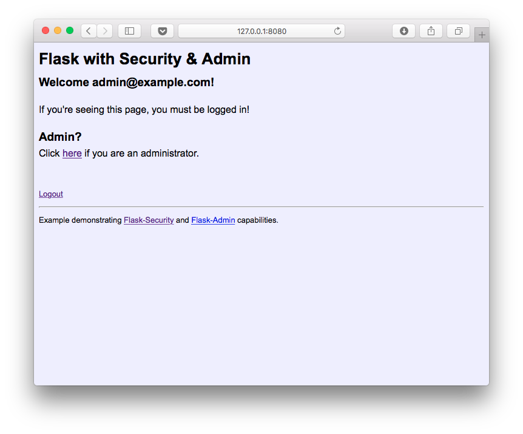

## Example App with Flask-Security & Flask-Admin
  
Flask-Security provides authentication and authorization to a Flask web application. Flask-Admin provides an interface to review and perform various operations on the application models (database tables).

The whole application is created as one _module_. 

### Resources/Links:

- Flask: http://flask.pocoo.org/
- Flask-Security: https://pythonhosted.org/Flask-Security/
- Flask-Admin: https://flask-admin.readthedocs.org/en/latest/

### Prerequisites:

- Python 3.3
- Flask
- Flask-Admin
- Flask-Security
- SQLAlchemy
- PostgreSQL or builtin SQLite

### How to Run

- Create a virtual environment
- Install the required packages via pip
- run the app by running `python app.py`
  - point the browser to http://127.0.0.1:8080/

### Screenshot of the Index page (after logging in)

version 1